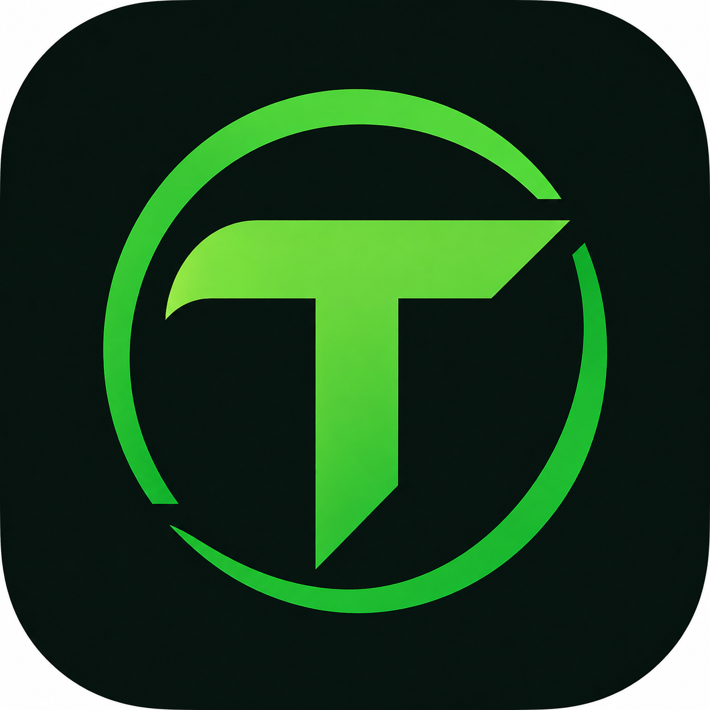

<p align="center">
  
</p>

<h1 align="center">Trak Registry</h1>

<p align="center">
  <strong>The Decentralized Curriculum Catalog & Blueprint Index for Trak CLI</strong>
</p>

<p align="center">
  <a href="registry.json"></a>
  <a href="templates/"></a>
  <a href="https://github.com/ndk123-web/trak"></a>
  <a href="https://github.com/ndk123-web/trak-web"></a>
  <a href="LICENSE"></a>
</p>

---

## ⚡ Overview

**Trak Registry** is the central, open-source curriculum index for the [Trak CLI](https://github.com/ndk123-web/trak) ecosystem. It hosts declarative JSON abstract syntax trees (AST) that define multi-module workspaces, source code, build configs, and hands-on cheatsheets.

By decoupling the template blueprints from the CLI binary, new learning tracks, updates, and community contributions are **streamed instantly** to users without requiring CLI recompilation or reinstallation.

---

## 🗂️ Registry Architecture

```text
trak-registry/
├── registry.json                 # Master catalog index and metadata registry
└── templates/                    # Hierarchical blueprint directory
    ├── lang/                     # 📦 Programming Languages
    │   ├── go.json
    │   ├── rust.json
    │   ├── typescript.json
    │   ├── python.json
    │   ├── javascript.json
    │   ├── java.json
    │   ├── cpp.json
    │   └── c.json
    ├── os/                       # 🐧 Operating Systems & Kernels
    │   ├── linux.json
    │   ├── macos.json
    │   └── windows.json
    ├── cloud/                    # ☁️ Cloud Platforms
    │   └── aws.json
    ├── db/                       # 🗄️ Databases & Storage
    │   ├── postgres.json
    │   ├── redis.json
    │   └── sql.json
    └── tool/                     # 🛠️ DevOps & Developer Tools
        ├── docker.json
        ├── k8s.json
        ├── terraform.json
        ├── ansible.json
        ├── git.json
        └── jenkins.json
```

---

## 📚 Master Blueprint Matrix (19 Tracks)

| Category | Identifier | Name | Modules | Version | Raw Endpoint |
| :--- | :--- | :--- | :---: | :---: | :--- |
| **`lang/`** | `lang/go` | Go (Golang) | 20 | `1.2.0` | [`templates/lang/go.json`](templates/lang/go.json) |
| **`lang/`** | `lang/rust` | Rust Systems | 22 | `1.0.0` | [`templates/lang/rust.json`](templates/lang/rust.json) |
| **`lang/`** | `lang/typescript` | TypeScript Fullstack | 18 | `1.0.0` | [`templates/lang/typescript.json`](templates/lang/typescript.json) |
| **`lang/`** | `lang/python` | Python Architecture | 20 | `1.0.0` | [`templates/lang/python.json`](templates/lang/python.json) |
| **`lang/`** | `lang/javascript` | JavaScript & Node.js | 18 | `1.0.0` | [`templates/lang/javascript.json`](templates/lang/javascript.json) |
| **`lang/`** | `lang/java` | Java & JVM Systems | 19 | `1.0.0` | [`templates/lang/java.json`](templates/lang/java.json) |
| **`lang/`** | `lang/cpp` | Modern C++ (C++23) | 19 | `1.0.0` | [`templates/lang/cpp.json`](templates/lang/cpp.json) |
| **`lang/`** | `lang/c` | C Low-Level Systems | 18 | `1.0.0` | [`templates/lang/c.json`](templates/lang/c.json) |
| **`os/`** | `os/linux` | Linux Systems & Bash | 21 | `1.0.0` | [`templates/os/linux.json`](templates/os/linux.json) |
| **`os/`** | `os/macos` | macOS & Darwin XNU | 16 | `1.0.0` | [`templates/os/macos.json`](templates/os/macos.json) |
| **`os/`** | `os/windows` | Windows & PowerShell | 18 | `1.0.0` | [`templates/os/windows.json`](templates/os/windows.json) |
| **`cloud/`** | `cloud/aws` | AWS Cloud Architecture | 22 | `1.0.0` | [`templates/cloud/aws.json`](templates/cloud/aws.json) |
| **`db/`** | `db/postgres` | PostgreSQL & DBA | 20 | `1.0.0` | [`templates/db/postgres.json`](templates/db/postgres.json) |
| **`db/`** | `db/redis` | Redis In-Memory Engine | 18 | `1.0.0` | [`templates/db/redis.json`](templates/db/redis.json) |
| **`db/`** | `db/sql` | Comprehensive SQL | 18 | `1.0.0` | [`templates/db/sql.json`](templates/db/sql.json) |
| **`tool/`** | `tool/docker` | Docker Containers | 20 | `1.0.0` | [`templates/tool/docker.json`](templates/tool/docker.json) |
| **`tool/`** | `tool/k8s` | Kubernetes (CKA/CKAD) | 22 | `1.0.0` | [`templates/tool/k8s.json`](templates/tool/k8s.json) |
| **`tool/`** | `tool/terraform` | Terraform Infrastructure | 18 | `1.0.0` | [`templates/tool/terraform.json`](templates/tool/terraform.json) |
| **`tool/`** | `tool/ansible` | Ansible Automation | 18 | `1.0.0` | [`templates/tool/ansible.json`](templates/tool/ansible.json) |
| **`tool/`** | `tool/git` | Git Internals & Workflows | 16 | `1.0.0` | [`templates/tool/git.json`](templates/tool/git.json) |
| **`tool/`** | `tool/jenkins` | Jenkins CI/CD Pipelines | 18 | `1.0.0` | [`templates/tool/jenkins.json`](templates/tool/jenkins.json) |

---

## 📄 Schema Contracts

### 1. `registry.json` (Catalog Index)
Provides categorized metadata and references to individual template endpoints.

```json
{
  "schema_version": "1.0.0",
  "updated_at": "2026-08-30T15:30:00Z",
  "categories": {
    "lang": {
      "title": "Programming Languages",
      "description": "Interactive learning workspaces for programming languages",
      "templates": {
        "go": {
          "name": "Go (Golang)",
          "description": "Comprehensive Go fundamentals, concurrency, channels, and microservices",
          "version": "1.2.0",
          "source": "templates/lang/go.json",
          "tags": ["golang", "concurrency", "backend", "goroutines"]
        }
      }
    }
  }
}
```

---

### 2. `templates/<category>/<tool>.json` (Blueprint AST Node Tree)
Defines the recursive directory and file hierarchy materialized on the user's filesystem.

```json
{
  "id": "lang/go",
  "name": "Go",
  "version": "1.2.0",
  "description": "Go concurrency and backend architecture",
  "root": {
    "name": "go-workspace",
    "type": "directory",
    "children": [
      {
        "name": "go.mod",
        "type": "file",
        "content": "module learn-go\n\ngo 1.22\n"
      },
      {
        "name": "00-setup",
        "type": "directory",
        "children": [
          {
            "name": "main.go",
            "type": "file",
            "content": "package main\n\nimport \"fmt\"\n\nfunc main() {\n\tfmt.Println(\"Hello Trak!\")\n}\n"
          },
          {
            "name": "README.md",
            "type": "file",
            "content": "# Module 00: Environment Setup\n"
          }
        ]
      }
    ]
  }
}
```

---

## 🛠️ How to Contribute a Blueprint

1. **Fork** this repository: `https://github.com/ndk123-web/trak-registry`
2. **Create a blueprint JSON file** under `templates/<category>/<tool>.json`:
   - Follow the 5 taxonomy rules:
     - `lang/` for programming languages
     - `os/` for operating systems
     - `cloud/` for cloud platforms
     - `db/` for databases
     - `tool/` for DevOps tools
3. **Register your blueprint** inside `registry.json`.
4. **Test locally** with Trak CLI:
   ```bash
   trak init <category>/<tool> --path ./test-workspace
   ```
5. **Open a Pull Request**!

---

## 🔗 Live Raw Streaming URLs

- **Master Catalog Index**:
  `https://raw.githubusercontent.com/ndk123-web/trak-registry/main/registry.json`
- **Go Blueprint**:
  `https://raw.githubusercontent.com/ndk123-web/trak-registry/main/templates/lang/go.json`
- **Kubernetes Blueprint**:
  `https://raw.githubusercontent.com/ndk123-web/trak-registry/main/templates/tool/k8s.json`
- **PostgreSQL Blueprint**:
  `https://raw.githubusercontent.com/ndk123-web/trak-registry/main/templates/db/postgres.json`

---

## 📜 Ecosystem & License

- ⚡ **[Trak CLI](https://github.com/ndk123-web/trak)** — The official Go binary workspace generator.
- 🌐 **[Trak Web](https://github.com/ndk123-web/trak-web)** — The interactive web portal and documentation app.

This project is licensed under the **MIT License**.
